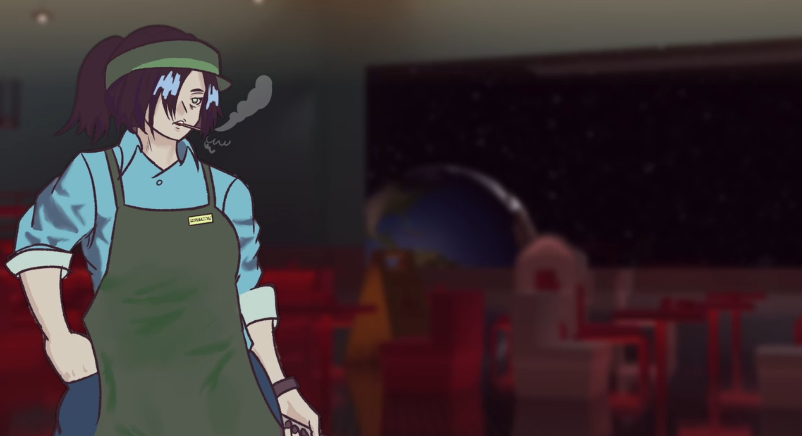

# Galaxy Grubhouse

## Overview

You are the only human on this moon's diner. A hungry crew of creatures will be asking for food in unknown languages. Use your trusty translator, and serve some food!

Programming by Ziyad
Programming by Lucas
Art by Sorindra

Mechanics:

- Click on a customer to take their order (their dialogue shows up on the bottom middle)
- Click on their order to show the food prep window
- Translate the customer order by opening the translator with space
- Enter the order into the food prep window and submit
- Complete 10 orders to finish the day

## Credits

### Fonts

- Stray by Aidan Levy
- Kron'thul by Umut Çomak
- Standard Galactic Alphabet by twts
- Glipervelz by Freddy V.P.
- Alien Hieroglyph by Poloviiinkin

### Music

- "Songs for the Supermarket" by Karl Jenkins

### Sound Effects

- "Slap" by Freesound Community (freesound.org)
- "Service/Receptionist Bell" by oxidvideos (freesound.org/pixabay)

### Engine

- Made with [Godot Engine](https://godotengine.org/) 4.x
